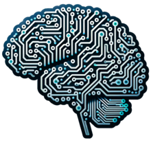

#  <h1 align="center">**Inteligencia Artificial (IA)**</h1>
### La inteligencia artificial (IA), en el contexto de las ciencias de la computación, es una disciplina y un conjunto de capacidades cognoscitivas e intelectuales expresadas por sistemas informáticos o combinaciones de algoritmos cuyo propósito es la creación de máquinas que imiten la inteligencia humana para realizar tareas, y que pueden mejorar conforme recopilen información.
## **IA y desarrolladores**
### Los desarrolladores emplean inteligencia artificial para realizar tareas de una forma más eficiente que, de otro modo, se realizarían manualmente: comunicaciones con clientes, identificación de patrones y resolución de problemas. Para comenzar con la inteligencia artificial, los desarrolladores deben contar con una formación en matemática y sentirse a gusto trabajando con algoritmos.
### Al comenzar a utilizar inteligencia artificial para desarrollar aplicaciones, lo mejor es comenzar de a poco. Al diseñar un proyecto relativamente simple, como un juego “Tres en línea”, aprenderá los conceptos básicos de la inteligencia artificial. Aprender con la práctica es una excelente forma de aumentar cualquier habilidad, y la inteligencia artificial no es distinta en este aspecto. Luego de completar uno o más proyectos pequeños, no hay límites para la inteligencia artificial.
###### ***Tomado de: https://www.oracle.com/co/artificial-intelligence/what-is-ai/***

## **Lenguajes de Programación en IA**
### La inteligencia artificial se beneficia enormemente de la variedad y riqueza de los lenguajes de programación disponibles. Cada lenguaje de programación ofrece diferentes ventajas para distintos aspectos de la IA.
### Por ejemplo, Python es ampliamente reconocido por su simplicidad y la extensa biblioteca de machine learning y procesamiento de lenguaje natural, mientras que Java puede ser preferido para aplicaciones empresariales debido a su robustez y portabilidad.
### Los lenguajes de programación no solo sirven como un medio para instruir a la máquina, sino que también estructuran la manera en que los problemas se conceptualizan y abordan. Lenguajes como R son ideales para estadísticas y visualización de datos, lo que es crucial en la fase de análisis de datos de la IA.
### Es fundamental que los programadores entiendan cómo las características de cada lenguaje pueden ser explotadas para maximizar las capacidades de la IA. La elección del lenguaje correcto puede determinar la eficacia con la que se pueden desarrollar aplicaciones de IA y cómo se pueden resolver tareas específicas dentro de un sistema.
###### ***Tomado de:https://www.dongee.com/tutoriales/inteligencia-artificial-como-aplicacion-de-la-programacion-logica/#:~:text=DongeeYulima%20Hernandez-,La%20Programación%20como%20Herramienta%20de%20Creación%20de%20IA,y%20funcionar%20de%20manera%20autónoma.***

